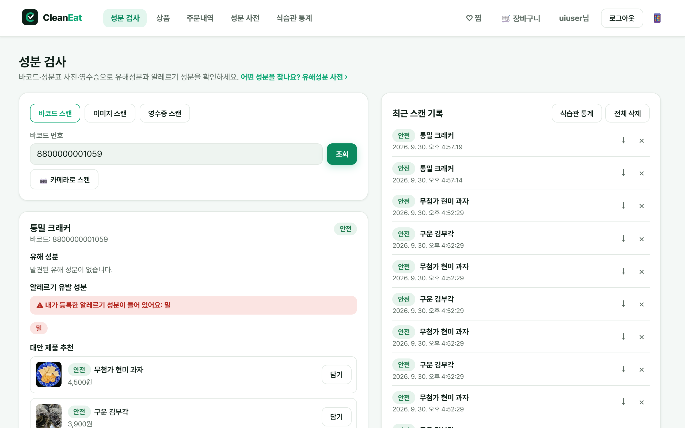
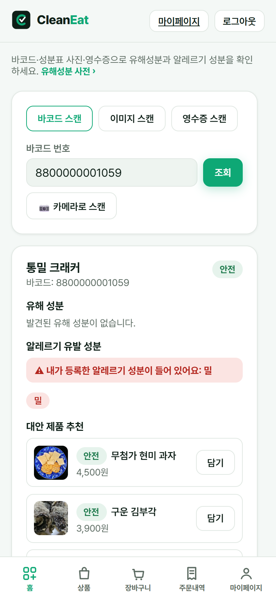
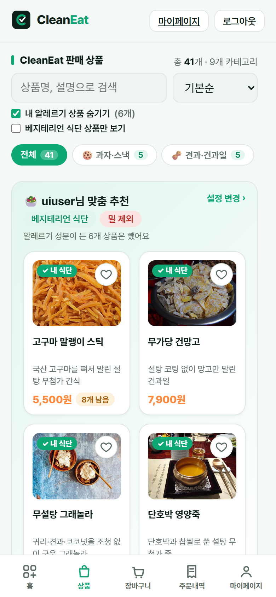
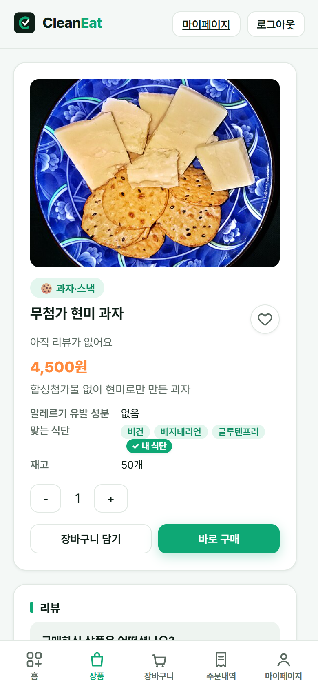
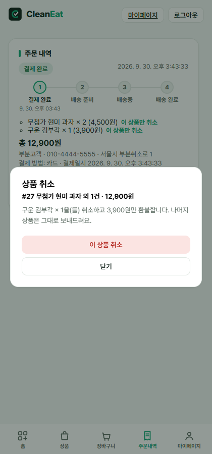
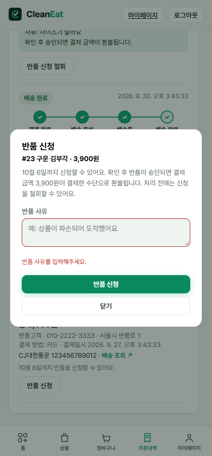
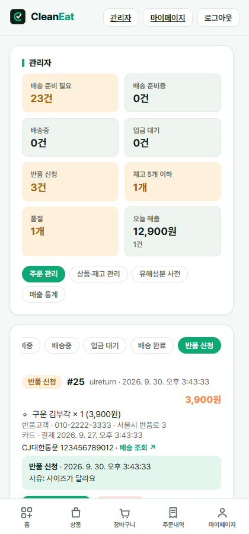
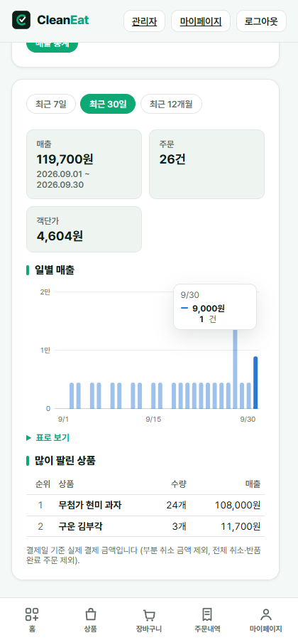
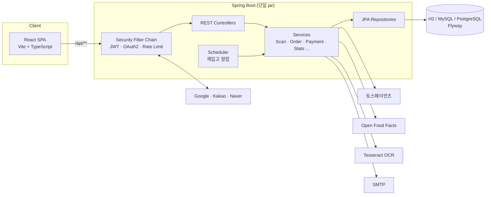
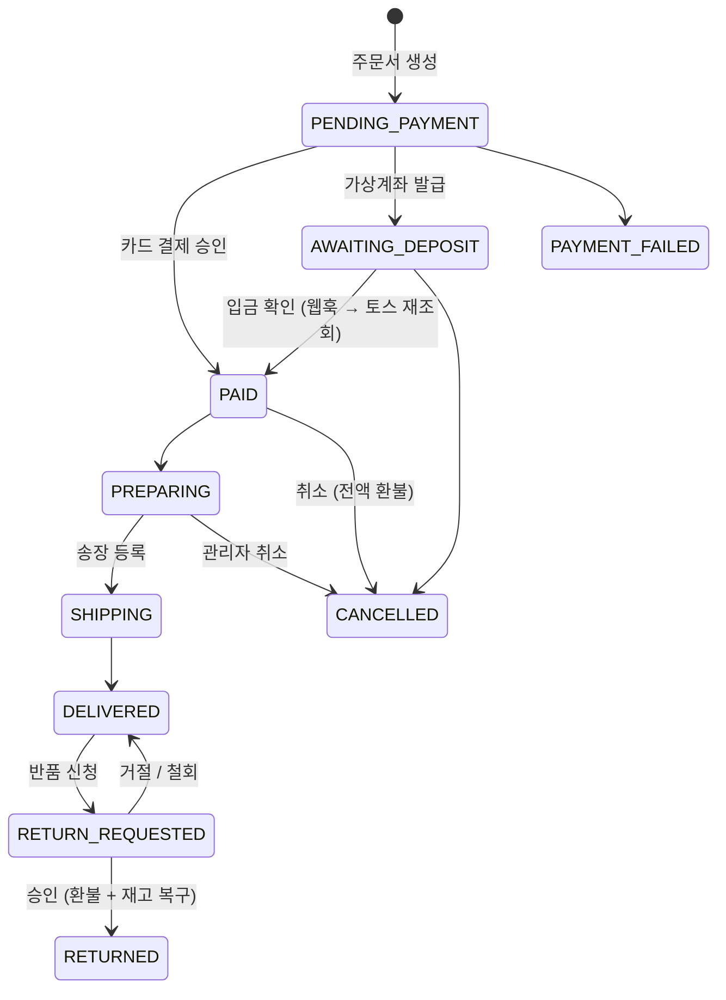

<div align="center">


# CleanEat

**바코드·성분표 사진 한 장으로 유해성분과 알레르기 성분을 확인하고, 안심하고 먹을 수 있는 식품을 바로 구매하는 서비스**

[](https://github.com/cjsrudgh98-crypto/CleanEat/actions/workflows/ci.yml)


</div>

<p align="center">
  
</p>

---

## 목차

- [프로젝트 소개](#-프로젝트-소개)
- [주요 기능](#-주요-기능)
- [화면](#-화면)
- [기술 스택](#-기술-스택)
- [아키텍처](#-아키텍처)
- [기술적으로 고민한 부분](#-기술적으로-고민한-부분)
- [테스트와 CI](#-테스트와-ci)
- [실행 방법](#-실행-방법)
- [프로젝트 구조](#-프로젝트-구조)
- [문서](#-문서)

---

## 📌 프로젝트 소개

식품 뒷면의 성분표는 길고 어렵습니다. 알레르기가 있거나 특정 식단(비건, 글루텐프리 등)을 지키는 사람은 제품을 살 때마다 성분을 하나하나 확인해야 합니다.

**CleanEat**은 이 과정을 줄여 줍니다.

1. **스캔**: 바코드를 찍거나, 성분표 사진이나 영수증을 올립니다.
2. **분석**: 유해성분 사전과 **내가 등록한 알레르기·식단**을 기준으로 위험도(안전 / 주의 / 위험)를 알려 줍니다.
3. **대안**: 더 안전한 제품을 추천하고, 그 자리에서 장바구니에 담아 **결제·배송·취소·반품**까지 처리합니다.

"성분 분석 서비스"와 "쇼핑몰"을 하나로 합쳤습니다. 관리자 기능(주문 처리, 재고, 매출 통계)까지 포함해 실제 운영을 전제로 만들었습니다.

---

## ✨ 주요 기능

### 🔍 성분 분석
| 기능 | 설명 |
|---|---|
| **바코드 스캔** | 카메라나 번호 입력으로 조회합니다. 자체 DB에 없으면 Open Food Facts에서 가져옵니다. |
| **이미지 / 영수증 OCR** | Tesseract(tess4j)로 성분표·영수증의 글자를 인식한 뒤 성분을 분석합니다. |
| **개인 맞춤 경고** | 내 알레르기 성분이 들어 있으면 따로 강조해서 경고합니다. |
| **대안 제품 추천** | 같은 카테고리에서 위험도가 낮고 내 알레르기·식단에 맞는 제품을 추천합니다. |
| **PDF 리포트** | 스캔 결과를 한글 PDF로 내려받습니다(나눔고딕 폰트 임베드). |
| **유해성분 사전 · 식습관 통계** | 성분별 설명을 제공하고, 기간별 스캔 위험도 통계를 보여 줍니다. |

### 🛒 쇼핑몰
| 기능 | 설명 |
|---|---|
| **맞춤 상품 목록** | 내 알레르기 상품을 숨기고, 내 식단에 맞는 상품을 표시합니다. 검색, 정렬, 카테고리 필터를 지원합니다. |
| **장바구니 · 찜 · 리뷰** | 재고와 수량 상한을 검증합니다. 리뷰는 구매한 회원만 쓸 수 있습니다. |
| **토스페이먼츠 결제** | 카드와 가상계좌를 지원합니다. 금액 위변조를 검증하고 멱등 키로 중복 결제를 막습니다. |
| **주문 흐름** | 결제 완료 → 배송 준비 → 배송중 → 배송 완료 단계를 보여 주고, 택배사별 배송 조회 링크를 제공합니다. |
| **취소 · 부분 취소 · 반품** | 상품 단위로 부분 환불할 수 있습니다. 가상계좌 주문은 환불 계좌 입력 폼을 거칩니다. 반품은 신청 → 승인/거절 흐름으로 처리합니다. |
| **재입고 알림** | 품절 상품을 구독하면 재입고 시 메일을 보냅니다(스케줄러). |

### 🛠 관리자
| 기능 | 설명 |
|---|---|
| **대시보드** | 배송 준비 필요, 입금 대기, 반품 신청, 재고 부족, 오늘 매출을 한눈에 보여 줍니다. |
| **주문 관리** | 상태별로 필터링하고 송장을 등록합니다. 관리자 취소·부분 취소를 할 수 있고 반품을 승인하거나 거절합니다. |
| **상품 · 재고 · 유해성분 사전 관리** | CRUD와 재고 조정을 합니다. |
| **매출 통계** | 7일, 30일, 12개월 매출 추이 차트와 판매 순위를 보여 줍니다. |

### 🔐 회원
- JWT 인증 + **소셜 로그인**(Google, Kakao, Naver OAuth2)
- 이메일 인증번호 가입과 비밀번호 찾기
- 비밀번호를 바꾸면 **기존 토큰을 모두 무효화**(토큰 버전)
- 로그인·인증번호 요청 **Rate Limit**

---

## 📱 화면

<table>
  <tr>
    <td align="center"><b>성분 검사 결과</b></td>
    <td align="center"><b>맞춤 상품 목록</b></td>
    <td align="center"><b>상품 상세</b></td>
  </tr>
  <tr>
    <td></td>
    <td></td>
    <td></td>
  </tr>
  <tr>
    <td align="center"><b>상품 단위 부분 취소</b></td>
    <td align="center"><b>반품 신청</b></td>
    <td align="center"><b>관리자 대시보드</b></td>
  </tr>
  <tr>
    <td></td>
    <td></td>
    <td></td>
  </tr>
  <tr>
    <td align="center"><b>매출 통계</b></td>
    <td></td>
    <td></td>
  </tr>
  <tr>
    <td></td>
    <td></td>
    <td></td>
  </tr>
</table>

> 모바일에서는 하단 탭바, 데스크톱에서는 상단 내비게이션을 쓰는 반응형 레이아웃입니다.

---

## 🧰 기술 스택

| 영역 | 기술 |
|---|---|
| **Backend** | Java 21, Spring Boot 3.5 (Web, Data JPA, Security, OAuth2 Client, Validation, Mail, Actuator), WebClient |
| **Auth** | JWT (jjwt), OAuth2 (Google / Kakao / Naver) |
| **DB** | H2 (로컬 기본), MySQL, PostgreSQL (운영), **Flyway** 마이그레이션 |
| **외부 연동** | 토스페이먼츠 결제 API, Open Food Facts, Tesseract OCR (tess4j), OpenPDF |
| **Frontend** | React 19, TypeScript, Vite 8, React Router 7 |
| **Test** | JUnit 5, Spring Boot Test, Spring Security Test, Vitest, Testing Library (jsdom) |
| **DevOps** | Docker (멀티 스테이지), GitHub Actions CI, Dependabot |

---

## 🏗 아키텍처



- 프론트엔드는 Maven 빌드 과정에서 함께 빌드되고(`frontend-maven-plugin`) **하나의 jar**에 담깁니다. 같은 주소에서 SPA와 API를 함께 서빙하므로 CORS 없이 배포할 수 있습니다.
- 주문 상태 흐름:



---

## 💡 기술적으로 고민한 부분

<details>
<summary><b>1. 결제 금액 위변조와 중복 처리 방지</b></summary>

- 결제 승인 전에 서버가 계산한 주문 금액과 클라이언트가 보낸 금액이 같은지 검증합니다.
- 토스 API 호출에 **멱등 키**를 붙여, 재시도나 이중 클릭으로 같은 요청이 두 번 가도 한 번만 처리되게 했습니다. 부분 취소는 `cancel-{주문}-item-{상품}` 형식의 키를 씁니다.
- 가상계좌 입금은 웹훅으로 받습니다. 웹훅은 secret 값을 상수 시간 비교로 검증합니다. 웹훅에 담긴 상태는 그대로 믿지 않고 토스 API로 결제를 다시 조회해서 반영합니다.
</details>

<details>
<summary><b>2. 부분 취소 · 반품의 금액 정합성</b></summary>

- 상품 단위로 취소하면 해당 금액만 환불하고, 남은 상품은 그대로 배송합니다. 마지막 상품까지 취소되면 주문 전체가 취소 상태로 바뀝니다.
- 매출 통계는 **부분 취소 금액을 빼고**, 전체 취소·반품 완료 주문도 제외해서 실제 매출과 일치시켰습니다.
- 가상계좌 결제를 환불할 때는 환불 계좌 정보가 필요해서, 전용 입력 폼을 만들고 검증을 붙였습니다.
</details>

<details>
<summary><b>3. 인증 보안</b></summary>

- JWT에 `ver`(토큰 버전) 클레임을 넣었습니다. 비밀번호를 바꾸면 버전이 올라가서 **탈취된 기존 토큰이 즉시 무효화**됩니다.
- 로그인·인증번호 요청에 IP 기준 Rate Limit을 걸고, 인증번호 확인은 5회까지만 허용합니다.
- 인증·인가 실패는 일관된 JSON 에러 응답(401/403)으로 돌려줍니다.
</details>

<details>
<summary><b>4. 스키마 관리: <code>ddl-auto: update</code>에서 Flyway로</b></summary>

- H2, MySQL, PostgreSQL 각각의 마이그레이션을 `db/migration/{vendor}`에 두었습니다. Hibernate는 `validate`만 하므로, 마이그레이션을 빠뜨리면 **서버가 기동 단계에서 실패**합니다.
- 이미 운영 중이던 DB는 `baseline-on-migrate`로 이력만 기록하고 옮겼습니다(실제 로컬 MySQL로 검증).
</details>

<details>
<summary><b>5. 성능: N+1 제거와 페이지네이션</b></summary>

- `default_batch_fetch_size`로 상품 목록 조회의 연관 엔티티를 묶어서 가져옵니다. 쿼리 수가 **143회에서 수 회로** 줄었습니다.
- 스캔 기록, 주문 내역, 관리자 주문 목록은 모두 페이지 단위 응답과 "더 보기"로 불러옵니다.
</details>

<details>
<summary><b>6. 배포 이미지와 OCR 네이티브 의존성</b></summary>

- tess4j는 시스템의 Tesseract와 Leptonica 버전에 민감합니다. 그래서 실행 이미지를 Debian trixie로 두고 JRE만 복사해 넣는 멀티 스테이지 Dockerfile을 만들었습니다.
- CI도 같은 배포판 컨테이너에서 테스트해서, OCR이 로컬에서만 되는 상황을 막았습니다.
- 운영 기동 상태는 `/actuator/health`의 liveness와 readiness로 확인합니다. 메일 서버 장애로 서버가 재시작되지 않도록 메일 헬스체크는 뺐습니다.
</details>

<details>
<summary><b>7. 라이선스</b></summary>

- PDF에 넣는 한글 폰트는 처음에 재배포가 허용되지 않는 시스템 폰트였습니다. 이를 **나눔고딕(SIL OFL)**으로 바꾸고 라이선스 전문을 함께 넣었습니다.
</details>

---

## ✅ 테스트와 CI

| 구분 | 내용 |
|---|---|
| **백엔드** | JUnit 5 테스트 **280여 개**: 서비스 단위, 컨트롤러·보안 통합, 결제 멱등성, 부분 취소·반품, 매출 집계, PDF 한글 렌더링, OCR |
| **프론트엔드** | Vitest + Testing Library 테스트 **50여 개**: 주문 취소·반품 폼 검증, 차트 스케일, 재입고 알림 버튼 등 |
| **CI** ([`ci.yml`](.github/workflows/ci.yml)) | push와 PR마다 ① 백엔드 테스트(Debian 컨테이너 + tessdata) ② 프론트 lint, test, build ③ Docker 이미지 빌드 |
| **Dependabot** | Maven, npm, GitHub Actions 의존성 업데이트 PR을 매주 자동으로 올립니다. |

```bash
# 백엔드
cd backend && mvn test

# 프론트엔드
cd frontend && npm ci && npm run lint && npm test && npm run build
```

---

## 🚀 실행 방법

### 요구 사항
- JDK 21
- Maven 3.9+
- Node.js는 설치하지 않아도 됩니다(Maven 빌드가 Node 22를 내려받아 프론트를 함께 빌드).

### 1. 가장 빠르게 (H2 메모리 DB)

```bash
cd backend
mvn package -DskipTests
java -jar target/CleanEat.jar
```

→ http://localhost:8080 에 접속합니다. 샘플 상품과 유해성분 사전이 자동으로 들어갑니다.

### 2. 프론트 개발 서버 (핫 리로드)

```bash
# 터미널 1
cd backend && mvn spring-boot:run

# 터미널 2
cd frontend && npm install && npm run dev   # http://localhost:5173 (API는 8080으로 프록시)
```

### 3. Docker

```bash
# 저장소 루트에서 (프론트까지 함께 빌드)
docker build -f backend/Dockerfile -t cleaneat .
docker run -p 8080:8080 cleaneat
```

### 선택 설정 (환경 변수)

| 변수 | 용도 |
|---|---|
| `SPRING_PROFILES_ACTIVE=mysql` / `prod` | MySQL / PostgreSQL 사용 |
| `APP_JWT_SECRET` | JWT 서명 키 (운영 필수) |
| `TOSS_CLIENT_KEY`, `TOSS_SECRET_KEY` | 토스페이먼츠 키 (없으면 테스트 키) |
| `ADMIN_USERNAMES` | 관리자로 지정할 아이디 목록 |
| OAuth 키 | [`OAUTH_SETUP.md`](backend/OAUTH_SETUP.md) 참고 |

자세한 운영 배포 방법(PostgreSQL, 메일, 헬스체크, Flyway)은 [`DEPLOYMENT.md`](backend/DEPLOYMENT.md)에 있습니다.

---

## 📁 프로젝트 구조

```
CleanEat
├── backend/                         # Spring Boot (프론트 빌드 결과까지 포함해 jar 하나로 배포)
│   ├── src/main/java/org/example/
│   │   ├── config/                  # 시드 데이터, 스케줄러, WebClient 설정
│   │   ├── controller/              # REST API (스캔, 상품, 주문, 결제, 관리자 ...)
│   │   ├── service/                 # 비즈니스 로직 (OCR, 위험도 분석, 주문·결제, 매출 통계 ...)
│   │   ├── domain/                  # JPA 엔티티
│   │   ├── repository/
│   │   ├── security/                # JWT, OAuth2, Rate Limit
│   │   ├── dto/  exception/  mail/
│   ├── src/main/resources/
│   │   ├── db/migration/{h2,mysql,postgresql}/   # Flyway
│   │   └── fonts/                   # 나눔고딕 (OFL)
│   ├── Dockerfile
│   ├── DEPLOYMENT.md
│   └── OAUTH_SETUP.md
├── frontend/                        # React + TypeScript + Vite
│   └── src/
│       ├── pages/                   # 홈(스캔), 상품, 장바구니, 주문, 마이페이지, 관리자 ...
│       ├── components/              # 주문 액션 폼, 매출 차트, 재입고 알림 ...
│       ├── api/  auth/  lib/  layout/  styles/
│       └── test/
├── docs/screenshots/
└── .github/                         # CI 워크플로, Dependabot
```

---

## 📚 문서

- [배포 가이드 (DEPLOYMENT.md)](backend/DEPLOYMENT.md): 운영 프로필, DB, 헬스체크, Flyway, CI
- [소셜 로그인 설정 (OAUTH_SETUP.md)](backend/OAUTH_SETUP.md): Google, Kakao, Naver 키 발급과 설정

---

<div align="center">

**CleanEat**: 먹기 전에, 한 번 더 확인하세요 🥗

</div>
